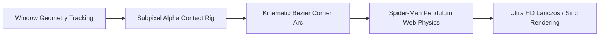

<div align="center">

# 🕷️ KuttyPets

### *Ultra-Fluid, Biomechanically Simulated Desktop Companions for Linux, macOS & Windows*

[](https://github.com/Kuttykishorekk/kuttypets/releases/latest)
[](https://github.com/Kuttykishorekk/kuttypets)
[](https://python.org)
[](LICENSE)

<br/>

**KuttyPets** is a cross-platform desktop companion engine featuring **subpixel alpha contact physics**, **Spider-Man silk pendulum web swinging**, **biomechanical Bezier corner climbs with muscular effort curves**, and **zero-latency live window tracking**.

[Downloads](#-quick-downloads--installation) • [Key Features](#-key-features) • [Architecture](#-architecture) • [Characters](#-character-roster) • [Contributing](#-contributing)

</div>

---

## 🚀 Quick Downloads & Installation

### 🪟 Windows (10 / 11) — *Zero-Setup One-Click Run*
1. Download **[`KuttyPets-Windows-x64.zip`](https://github.com/Kuttykishorekk/kuttypets/releases/latest)** from the latest release.
2. Extract the folder and double-click **`KuttyPets.exe`**.
3. *No Python, Git, or extra installation required!*

---

### 🍎 macOS (Apple Silicon M1–M5 & Intel)
```bash
# Option A: Standalone App
# Download KuttyPets-macOS.zip from Releases, unzip, and drag KuttyPets.app to /Applications

# Option B: Terminal / Homebrew
git clone https://github.com/Kuttykishorekk/kuttypets.git
cd kuttypets
pip install -e ".[macos]"
kuttypets --character spiderman --mode lively
```

---

### 🐧 Linux (Arch / Hyprland / Wayland / Sway)
```bash
# Clone and install locally
git clone https://github.com/Kuttykishorekk/kuttypets.git
cd kuttypets
pip install -e .

# Launch Spider-Man with live Hyprland socket tracking
kuttypets --character spiderman --mode lively
```

---

## ✨ Key Features



- 🧗 **Biomechanical Muscle Corner Arcs**: 
  - Smooth Bezier curves around window roundings (Hyprland 24px, macOS 22px, Win11 8px).
  - Four distinct muscular phases: `plant` $\to$ `reach` $\to$ `pull` (with squash & stretch) $\to$ `settle`.
  - Body lean tangent vectors dynamically aligned with the curve trajectory.

- 🪟 **Strict Inward Window Sill Alignment**:
  - Scans raw sprite alpha channels to measure solid hand/foot contact grip lines.
  - Sits, idles, and crawls strictly **inside the window glass sill** with 0 subpixel overshoot.

- 🕸️ **Spider-Man Constrained Pendulum Web Swings**:
  - Fixed-length rope tension calculations with gravity, damping, and tangential release impulses.
  - Multi-swing combo chains and fading silk afterimages.

- ⚡ **Cross-Platform Native Window Adapters**:
  - **Linux**: Direct UNIX domain socket IPC (`.socket.sock` & `.socket2.sock`) with zero process overhead.
  - **macOS**: `Quartz.CGWindowListCopyWindowInfo` with AeroSpace and Yabai support.
  - **Windows**: Win32 `DWMWA_EXTENDED_FRAME_BOUNDS` via `dwmapi.dll` ignoring drop shadows.

- 🎨 **Ultra HD Resampling**:
  - Lanczos / Sinc high-order filtering for crisp pixel art on 1080p, 1440p, 4K, and Retina ProMotion displays.

---

## 🎭 Character Roster

| Character | Source | Physics Format | Special Ability |
| :--- | :--- | :--- | :--- |
| **Spider-Man** | Marvel | `shimeji` | Silk Pendulum Web Swinging & Rail Crawl |
| **Hu Tao** | Genshin Impact | `genshin` | Ghost Butterflies & Dancing Pyrotechnics |
| **Klee** | Genshin Impact | `genshin` | Lucky Clovers & Energetic Sparkles |
| **Kamisato Ayaka** | Genshin Impact | `genshin` | Floating Sakura Petals & Elegant Walks |
| **Venti** | Genshin Impact | `genshin` | Floating Anemo Feathers & Melodic Idles |

---

## 🎮 Command-Line Options

```bash
kuttypets [OPTIONS]
```

| Flag | Description | Options | Default |
| :--- | :--- | :--- | :--- |
| `--character, -c` | Active companion character | `spiderman`, `hutao`, `klee`, `ayaka`, `venti` | `spiderman` |
| `--mode, -m` | Companion activity cadence | `calm`, `lively`, `stealth` | `calm` |
| `--scale, -s` | Render scale multiplier | Float value (e.g. `0.68`, `1.0`) | `0.68` |
| `--list-characters`| Print all discovered character packages | — | — |

---

## 🛠️ Project Structure

```text
kuttypets/
├── .github/workflows/         # Cross-platform multi-OS CI/CD build matrix
├── kuttypets/
│   ├── config.py              # Dynamic character discovery & presence profiles
│   ├── main.py                # Auto OS adapter factory & entrypoint
│   ├── core/
│   │   ├── engine.py          # Unified state machine, loop & physics coordinator
│   │   ├── kinematics.py      # Dynamic Bezier corner curves & stride gait cycles
│   │   ├── web_physics.py     # Spider-Man pendulum swings & silk line tension
│   │   └── rigs.py            # Subpixel alpha grip & contact point analyzer
│   ├── adapters/
│   │   ├── base.py            # Standardized WindowInfo interface
│   │   ├── linux_hyprland.py  # Direct Hyprland socket IPC client
│   │   ├── mac_cocoa.py       # macOS Quartz & CoreGraphics adapter
│   │   └── win32_adapter.py   # Windows Win32 / DWM adapter
│   ├── render/
│   │   ├── particles.py       # Zero-allocation particle pool
│   │   └── shadows.py         # Directional ambient occlusion contact shadows
│   └── characters/            # High-resolution sprite assets
├── packaging/                 # Linux, macOS, and Windows build specifications
├── pyproject.toml             # Python packaging specification
└── README.md
```

---

## 📄 License

Distributed under the **MIT License**. See [`LICENSE`](LICENSE) for more details.
